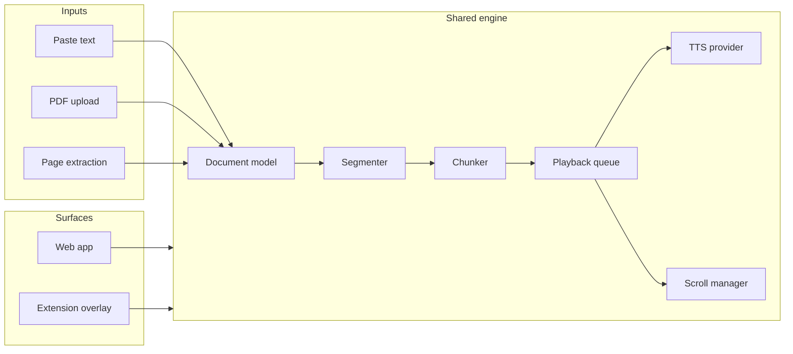

# ReadAlong TTS MVP — Architecture and Implementation Plan

## Strict constraints (non-negotiable)

- **No server for TTS in MVP.** All synthesis runs in the browser (Kokoro.js local inference). No backend TTS calls.
- **Web Speech API is not the main solution.** It is fallback only when Kokoro fails; primary path is always Kokoro (or future premium local/hosted behind the same interface).
- **No word-level timestamps unless the model/provider supports them.** Chunk-level sync is acceptable and sufficient for MVP. Do not fake word timings; if we add word-level later, it will be when a provider exposes real timing data.
- **No OCR in MVP.** Expose a clean interface stub only (e.g. `IOCRProvider` / `extractTextFromImage()`) for future use; no implementation.
- **No overcomplication of auth, database, or billing.** Local-first MVP: IndexedDB for cache and reading positions; no user accounts, no remote DB, no payments. Optimize for “works offline, feels premium.”
- **Do not hide hard problems.** Implement and test properly:
  - **Click-to-seek**: Resolve click (offset or element) → chunk index → queue seek → cancel in-flight synthesis → start from new chunk; no stale highlight or wrong chunk playing.
  - **Queue cancellation**: Generation id or cancellation token; on seek, cancel pending synthesis and in-flight playbacks; no overlapping audio or wrong chunk playing after seek.
  - **Chunk mapping**: Bi-directional, stable mapping chunk ↔ source offsets ↔ DOM element IDs; document it and test edge cases (empty blocks, merged/split chunks).
  - **Scroll synchronization**: Current chunk scrolls into view (centered); smooth, no jitter; single source of truth for “current” chunk driving both highlight and scroll.
- **Optimize for a working, premium-feeling MVP over architectural vanity.** Prefer simple, testable code and clear data flow over excessive abstraction. Add extension points only where they directly serve the product (e.g. TTS provider swap).
- **Every important technical choice must be explained in docs.** `docs/ARCHITECTURE.md` (and any runbooks) must document why we chose chunk-level sync, why Kokoro first, how cancellation works, how click-to-seek resolves, etc.
- **Show the codebase incrementally and keep it runnable.** After each phase (and within phases where sensible), the repo must build and run; no long “broken until Phase 4” stretches. Prefer small, shippable steps.

---

## 1. Architecture document (to be written in `/docs`)

Before or alongside Phase 1, add a technical design doc at **[docs/ARCHITECTURE.md](docs/ARCHITECTURE.md)** covering:

- **Document model**: Normalized structure (document → blocks → paragraphs → sentences → tokens) with stable IDs and character offsets; used for paste, PDF-extracted text, and extension-extracted content. Single source of truth for “what to read” and “where we are.” **Text model vs render model**: Keep two layers explicit. (1) **Canonical text model**: used by playback, offsets, and chunking only—no rendering. (2) **Render model**: used by page view, reflow view, and in-page overlay mapping (PDF text layer, reflow DOM, extension overlay). Do not jam rendering concerns into the reading engine; the engine consumes the canonical text model and exposes chunk/offset data; each surface builds its own render mapping from that.
- **Chunking strategy**: **Strict numeric guardrails.** Default to sentence-based chunks. Split any sentence that exceeds a hard max (e.g. 250 characters or ~50 tokens) into sub-chunks; target chunk duration under ~3–6 seconds so playback feels responsive and highlight transitions stay crisp. Document the exact limits in ARCHITECTURE.md (e.g. `MAX_CHUNK_CHARS`, `MAX_CHUNK_TOKENS`, target duration). Exact mapping chunk ↔ source offsets ↔ DOM element IDs for click-to-seek and highlighting.
- **Highlight synchronization**: Chunk-level highlight for MVP only; queue “current” chunk drives highlight + scroll; no word-level unless a provider later exposes real timing data (and document why chunk-level is sufficient for MVP).
- **TTS provider abstraction**: Interface (`initialize`, `getVoices`, `synthesizeChunk`, `preloadChunks`, `cancel`, `dispose`); Kokoro as primary (local only in MVP); Browser Speech as fallback only; document why no server TTS in MVP and how a future hosted provider would plug in.
- **Extension architecture**: MV3; service worker + popup; content script for extraction and overlay; overlay reader in isolated root (Shadow DOM); message passing for controls. **Overlay-first**: Overlay mode is the default MVP; “read in place” (highlighting original page DOM) is experimental. Real pages are messy—prioritize shipping a reliable overlay; in-place only when mapping back to DOM is feasible and documented as best-effort.
- **Audio pipeline invariants** (hard rules; document in ARCHITECTURE.md): (1) Only one chunk may be “actively playing” at any time. (2) At most N next chunks (e.g. N=2–3) may be synthesizing or preloaded; cap the preload window. (3) On seek, all pending synthesis and in-flight playback must be invalidated via generation ID (or equivalent); no stale audio, no overlapping. (4) Cached audio in IndexedDB must be keyed by `textHash + voice + speed + providerVersion` so cache is correct and invalidatable.
- **Rationale for key choices**: In the same doc, explain every important technical decision—e.g. why chunk-level sync, why cancellation tokens/generation id for queue, how click-to-seek resolution works, why IndexedDB and no backend, OCR stub only, etc. No choice should be implicit.

High-level flow:

---

## 2. Monorepo layout and tech stack

- **Root**: `pnpm-workspace.yaml`; `package.json` (scripts: `build`, `dev`, `test`); TypeScript base config; no app code at root.
- **Apps**: [apps/web](apps/web) (Next.js 15+ App Router), [apps/extension](apps/extension) (Chrome MV3).
- **Packages**: [packages/reader-core](packages/reader-core), [packages/tts-core](packages/tts-core), [packages/ui](packages/ui) (shared UI; Tailwind, React).
- **Docs**: [docs/](docs/) for ARCHITECTURE.md and any runbooks.
- **Stack**: TypeScript strict; Tailwind; Zustand; PDF.js (web app); IndexedDB for cache + reading positions only (no remote DB, no auth, no billing); Kokoro.js as primary TTS; browser Speech Synthesis as fallback only. Local-first: no server required for TTS in MVP.

**Performance budgets** (concrete targets; document in ARCHITECTURE.md and enforce where feasible):

- Initial UI is interactive before the TTS model is ready (e.g. paste, toolbar, empty state).
- Voice/model initialization message is visible immediately (no blank screen).
- First chunk playback begins within an acceptable time after pressing play (e.g. < 3–5 s when model is warm; define “acceptable” and document).
- Seek-to-new-position feels near-immediate once the model is warm (cancel old, start new; no long stall).
- Scrolling never blocks user input (scroll in rAF or idle; never block main thread).

---

## 3. Phase 1 — Foundation (monorepo + core + simple reader)

**3.1 Monorepo scaffold**

- pnpm workspace with `apps/`* and `packages/`*.
- Root: `pnpm-workspace.yaml`, `tsconfig.base.json`, `package.json` with `dev`, `build`, `test` (e.g. vitest).
- Each app/package has own `package.json`, `tsconfig.json` extending base; build outputs to `dist` or Next.js default.

**3.2 Shared packages (skeleton + core)**

- **packages/reader-core**
  - **Document model** ([packages/reader-core/src/document-model.ts](packages/reader-core/src/document-model.ts)): Types for `Document`, `Block`, `Paragraph`, `Sentence`, `Chunk` with `id`, `startOffset`, `endOffset`, `text`; factory to build from raw text (and later from PDF/HTML).
  - **Segmenter** ([packages/reader-core/src/segmenter.ts](packages/reader-core/src/segmenter.ts)): Paragraph split (double newline / structure); sentence split (regex + heuristics; consider `sentence-splitter` or minimal custom).
  - **Chunker** ([packages/reader-core/src/chunker.ts](packages/reader-core/src/chunker.ts)): Sentences → TTS chunks. **Hard rules**: default to one chunk per sentence; split sentences above a strict max (e.g. 250 chars or ~50 tokens); target chunk duration ~3–6 s. Emit chunks with stable IDs and offset mapping. Document limits in ARCHITECTURE.md.
  - **Mapping** ([packages/reader-core/src/mapping.ts](packages/reader-core/src/mapping.ts)): Resolve click (offset or element id) → chunk index; chunk index → DOM selector / element id for highlight. Must be reliable and tested (edge cases: empty blocks, boundaries); document the resolution algorithm.
  - **Playback queue** ([packages/reader-core/src/playback-queue.ts](packages/reader-core/src/playback-queue.ts)): Ordered list of chunks; current index; play/pause/seek/skip sentence/paragraph; emit “current chunk” and “next N for preload”. **Must support cancellation**: generation id or cancellation token so that on seek we cancel pending synthesis and in-flight playback—no overlapping audio, no stale “current” chunk. Document cancellation semantics in ARCHITECTURE.md.
  - **Scroll manager** ([packages/reader-core/src/scroll-manager.ts](packages/reader-core/src/scroll-manager.ts)): Given “current chunk element id” or ref, scroll it into view (center preferred); smooth, no jitter; single source of truth—only “current chunk” drives scroll (and highlight). Interface only (actual scroll target injected by app/extension); document scroll strategy in ARCHITECTURE.md.
  - **Reader store** ([packages/reader-core/src/reader-store.ts](packages/reader-core/src/reader-store.ts)): Zustand store (or equivalent) for: document, chunks, current chunk index, playing, speed, voice id; actions: loadDocument, seekToChunk, play, pause, skipNext/Prev sentence/paragraph, setSpeed, setVoice; persist preferences and last position to IndexedDB (thin layer or dedicated module).
- **packages/tts-core**
  - **TTS provider interface** ([packages/tts-core/src/types.ts](packages/tts-core/src/types.ts)): `ITTSProvider`: `initialize()`, `getVoices()`, `synthesizeChunk(text, options) => Promise<ArrayBuffer|Blob|url>`, `preloadChunks(chunks)`, `cancel()`, `dispose()`.
  - **Kokoro provider** ([packages/tts-core/src/kokoro-provider.ts](packages/tts-core/src/kokoro-provider.ts)): Load Kokoro via `KokoroTTS.from_pretrained(...)`; cache instance; implement interface; chunk text per call; return audio blob/arraybuffer; support voice and optional speed (if Kokoro supports; else apply at playback).
  - **Browser fallback** ([packages/tts-core/src/browser-fallback-provider.ts](packages/tts-core/src/browser-fallback-provider.ts)): `SpeechSynthesis` + `Utterance`; one chunk per utterance; implement same interface for fallback only.
  - **IndexedDB cache** (optional in Phase 1): Cache key must be `textHash + voice + speed + providerVersion`. Only one chunk actively playing; cap preload (e.g. next 2–3 chunks); on seek, invalidate all pending work via generation ID. Document in ARCHITECTURE.md.
- **packages/ui** (minimal in Phase 1): Shared Tailwind config; optional shared components (e.g. PlayPause, SpeedSlider, VoiceSelect) used by web (and later extension if feasible). Can start with web-only components and extract to `packages/ui` in Phase 2.

**3.3 Web app — minimal reader**

- Next.js 15 App Router in [apps/web](apps/web); dependency on `reader-core`, `tts-core`, `ui`.
- **Single reader route** (e.g. `/reader` or `/`): One page with textarea “Paste text”; on submit, run document pipeline (raw text → document model → segmenter → chunker) and store in reader store.
- **Reader view**: Render document blocks/paragraphs with stable `data-chunk-id` (or paragraph/sentence ids that map to chunks); no PDF yet.
- **Playback**: Toolbar with play/pause, speed, voice; on play, use queue’s current chunk → call TTS provider `synthesizeChunk` → play audio in `<audio>` or AudioContext; on end, advance queue and play next chunk; highlight “current” chunk in the DOM (e.g. background color); no auto-scroll required in Phase 1.
- **Click-to-seek**: Click on paragraph/sentence → resolve to chunk index → queue seekToChunk → update store → start playback from that chunk.
- Ensure Kokoro model loads once (e.g. in layout or provider); show loading state during `initialize()`.

**3.4 Tests (Phase 1)**

- reader-core: segmenter (paragraph/sentence boundaries), chunker (chunk boundaries, IDs, offsets, respect max length), mapping (offset → chunk index), queue (seek, skip next/prev).
- tts-core: interface contract tests or mocks; optional: Kokoro provider init + one synthesize (integration).
- **State-machine tests**: Explicit tests for playback transitions—e.g. play → seek → pause → resume → speed change → seek again. Assert correct current chunk, no overlapping playback, no stale state. This category is required; most reader bugs show up in these transitions.

**3.5 README**

- Root README: pnpm install, pnpm build, pnpm dev; link to apps/web and apps/extension; high-level architecture pointer to `docs/ARCHITECTURE.md`.
- After Phase 1: “Run web app: `pnpm --filter web dev`” (or equivalent).

---

## 4. Phase 2 — Polished web reader

- **Layout**: Left sidebar (documents/library list; can be “Recent” or single doc for MVP), center reader viewport, top toolbar (open file, paste, voice, speed, play/pause, skip sentence/paragraph), optional right panel (TOC/outline/queue).
- **Highlight**: Strong highlight for current chunk; subtle “preview” for next chunk; CSS transitions for smooth change.
- **Auto-scroll**: Scroll manager wired to reader viewport; on current chunk change, scroll element into view (centered); debounce or requestAnimationFrame to avoid jitter.
- **Preferences**: Persist speed, voice, theme (light/dark) and last read position per document (IndexedDB); restore on load.
- **UX**: Loading states (model init, document processing), empty state (paste or upload), error states with clear messages; first-run note about model download/cache.
- **Accessibility**: Keyboard shortcuts (play/pause, skip, speed), focus management, contrast, focus indicators.
- **Tests**: Scroll manager behavior (mock scroll target); store persistence; click-to-seek → highlight and playback.

---

## 5. Phase 3 — PDF in web app

- **PDF.js**: Worker setup; load PDF; `getTextContent()` per page; build **canonical text model** from text items (merge into paragraphs/sentences by position and line breaks); keep page boundaries for **render model** (page-faithful view). Do not put render/PDF-specific concerns into reader-core; reader-core consumes the canonical document; web app owns page/reflow render mapping.
- **Page-faithful view**: Render PDF canvas + text layer; map text layer spans to chunk IDs (via offsets from canonical model); click on text → resolve to chunk → seek.
- **Reflow mode**: Extracted text rendered as normalized paragraphs (same chunk IDs); toggle in UI between “Page view” and “Reflow view”; both use same chunk model and playback.
- **Caching**: Store processed document metadata (and optionally chunk list) in IndexedDB by file hash/url; re-use on re-open.
- **PDF extraction quality**: Define “poor extraction” and enforce a fallback path. **Text-quality scoring**: e.g. low text density (few words per page), many isolated glyphs, or suspicious reading order. If score is below threshold: show warning, recommend reflow mode, or warn that the PDF is scan-like / may read poorly. Do not silently build a bad reading experience. Document scoring heuristics in ARCHITECTURE.md.
- **Edge cases**: Poor or no text extraction → warning + best-effort reading; use quality score to drive messaging. **OCR**: Do not implement; add a clean interface stub only (e.g. `IOCRProvider` with `extractTextFromImage(image): Promise<string>`) so future OCR can plug in; document in ARCHITECTURE.md.
- **Tests**: PDF text extraction → document model; page/reflow mapping to chunks; quality scoring (low density / bad order triggers warning or reflow recommendation).

---

## 6. Phase 4 — Chrome extension

- **Manifest V3**: [apps/extension/manifest.json](apps/extension/manifest.json) (service worker, popup, content script, permissions).
- **Popup**: Browser action; controls: “Read this page”, voice, speed, play/pause, skip; messaging to content script or offscreen doc for TTS if needed.
- **Content script**: Inject when user triggers “Read this page”; clone document → use [@mozilla/readability](https://www.npmjs.com/package/@mozilla/readability) (or similar) → extract title + content; sanitize (e.g. DOMPurify); build reader document model from HTML/text; render overlay reader in isolated root (Shadow DOM) to avoid page CSS; inject shared reader UI (reuse reader-core + tts-core).
- **Overlay reader**: Same concepts as web—chunks, highlight, click-to-seek, auto-scroll, playback controls; message passing for play/pause/seek/speed/voice between popup and overlay. **Overlay is the default and primary MVP.** Ship and polish overlay first.
- **Read in place**: **Experimental only.** Highlighting original page DOM is best-effort; real pages are messy. If mapping back to DOM is unreliable, fall back to overlay and document. Do not make in-place first-class until overlay is solid; avoid burning time on DOM edge cases before shipping.
- **SPA**: On route change (e.g. detect URL change), re-run extraction and offer “Re-extract and read” or similar.
- **Keyboard shortcuts**: Optional commands in manifest (play/pause, skip sentence/paragraph, speed up/down).
- **Tests**: Extraction output structure; overlay mount; message handling.

---

## 7. Phase 5 — Hardening and production cleanup

- **Fallback**: If Kokoro fails to load or synthesize, switch to BrowserSpeechFallbackProvider; surface in UI (“Using fallback voice”).
- **Performance**: Web Worker for document parsing/chunking where heavy; preload cap (e.g. next 2–3 chunks only); enforce audio invariants—one chunk playing, all pending invalidated on seek via generation ID; cache key = textHash + voice + speed + providerVersion. Meet performance budgets (UI interactive before model; first chunk in acceptable time; seek near-immediate when warm; scroll non-blocking).
- **Error handling**: User-facing messages for load failure, PDF errors, extraction failures; retry where appropriate.
- **Production**: Env/config for model URLs/cache limits; build and bundle size check; README updates for extension load and web deploy.
- **Tests**: E2E or integration for “paste → play → seek → highlight” and “extension: read page → play → seek”. **State-machine tests** (required): deterministic tests for playback transitions—play → seek → pause → resume → speed change → seek again—assert correct current chunk, no overlapping audio, no stale highlight; cover cancellation and generation ID behavior.

---

## 8. Key files summary

| Area      | Key files                                                                                           |
| --------- | --------------------------------------------------------------------------------------------------- |
| Doc model | `packages/reader-core/src/document-model.ts`, `segmenter.ts`, `chunker.ts`, `mapping.ts`            |
| Playback  | `packages/reader-core/src/playback-queue.ts`, `scroll-manager.ts`, `reader-store.ts`                |
| TTS       | `packages/tts-core/src/types.ts`, `kokoro-provider.ts`, `browser-fallback-provider.ts`              |
| Web       | `apps/web`: reader page, PDF container, reflow component, toolbar, store wiring                     |
| Extension | `apps/extension`: manifest, service worker, popup, content script, overlay app, extraction pipeline |
| Docs      | `docs/ARCHITECTURE.md` (document model, chunking, highlight sync, provider abstraction, extension)  |

---

## 9. Implementation order (concrete)

**Principle:** Optimize for a working, premium-feeling MVP. Show the codebase incrementally; after each step the repo must build and run (no long broken stretches).

1. **Scaffold**: Root + apps/web + apps/extension + packages (reader-core, tts-core, ui); all compile and `pnpm build` succeeds. Web app runs (e.g. empty or landing); extension loads.
2. **reader-core**: Document model types and text ingestion → segmenter → chunker → mapping (with tests for click-to-seek resolution and chunk boundaries); playback-queue with **cancellation/generation id** and state + actions; scroll-manager interface; reader-store with Zustand and IndexedDB for prefs/position only (no auth/DB).
3. **tts-core**: Interface; KokoroLocalTTSProvider (primary, local only); BrowserSpeechFallbackProvider (fallback); wire to reader-core so queue requests synthesis and plays result; cancel in-flight on seek.
4. **Web Phase 1**: One reader page (paste → document → render chunks → play/pause/seek, highlight current chunk). **Click-to-seek**: implement and test end-to-end (click → chunk index → seek → cancel old → play from new chunk). Runnable and testable.
5. **Phase 2**: Layout, auto-scroll (scroll sync from current chunk only), strong/subtle highlight, preferences, a11y, loading/empty/error states.
6. **Phase 3**: PDF.js, canonical text model from extraction; page + reflow **render** views with separate render mapping; text-quality scoring and fallback for poor PDFs; caching; OCR interface stub only.
7. **Phase 4**: Extension MV3, extraction, **overlay-first** reader (overlay default; in-place experimental), messaging.
8. **Phase 5**: Fallback logic, workers, preload/cancel, errors, README and docs. Document all important technical choices in ARCHITECTURE.md.

No placeholder files beyond minimal “export” stubs where a phase is not yet implemented. Keep the repo buildable and runnable after each phase.